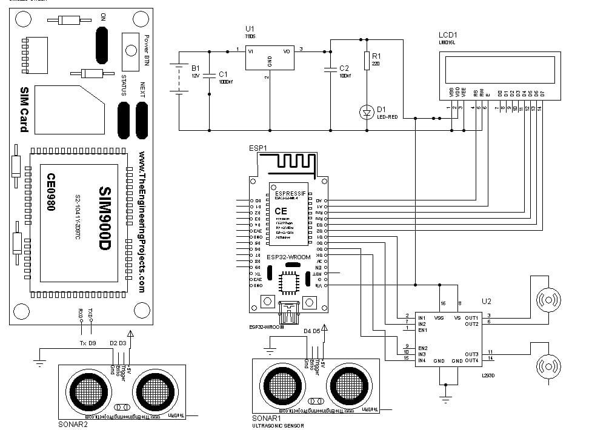
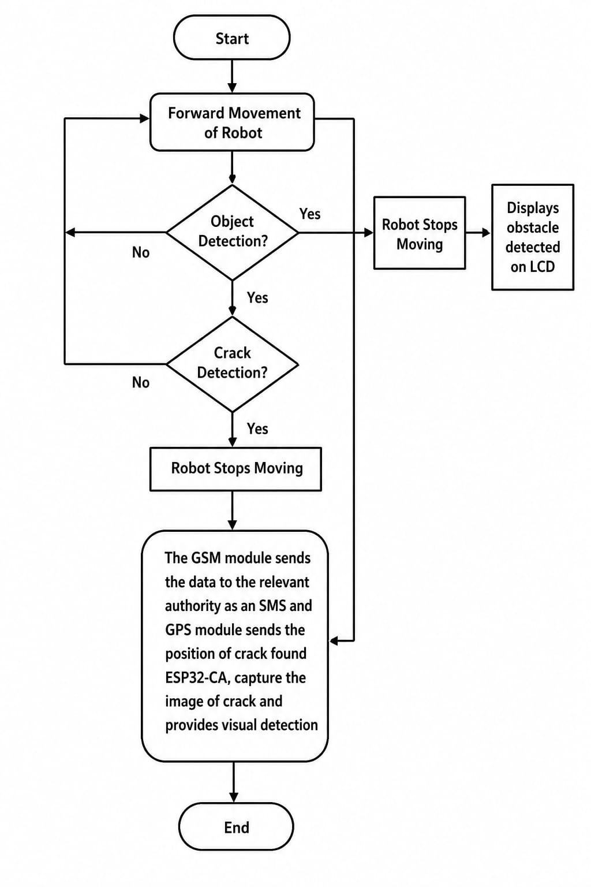
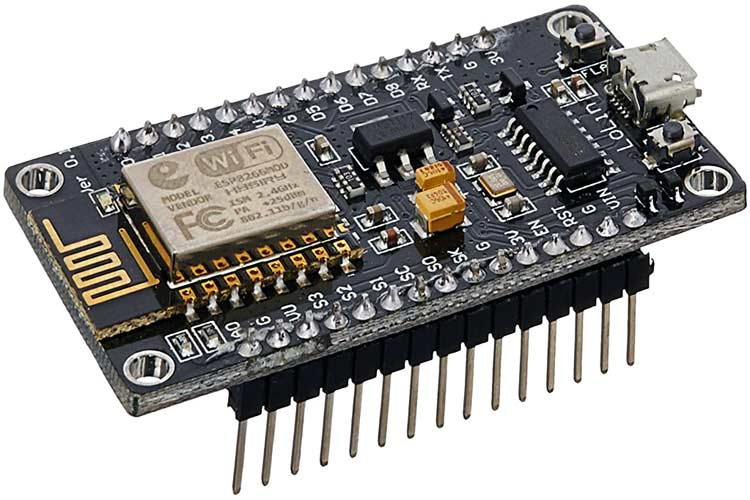
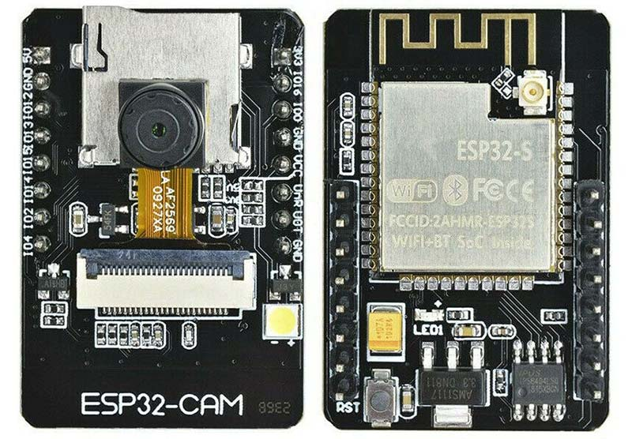
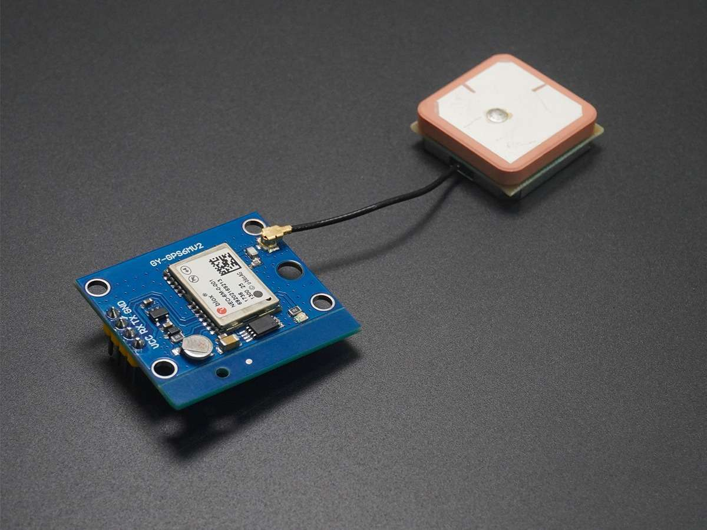
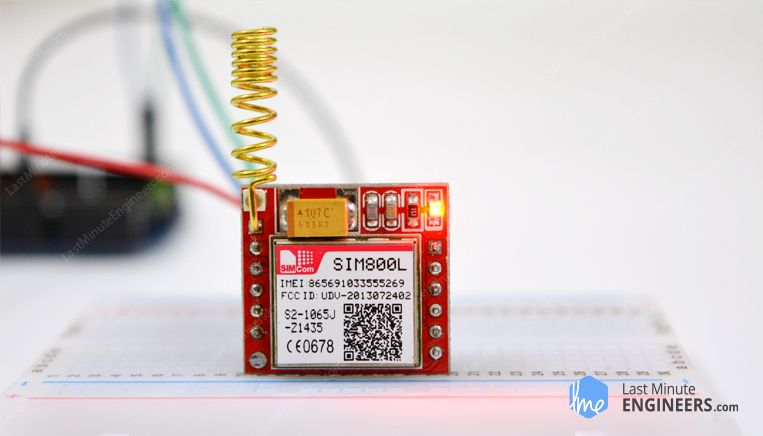
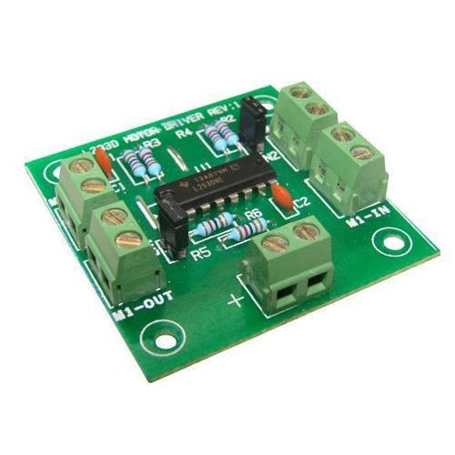

# IoT Based Railway Track Defect and Obstacle Detection System

An automated IoT-based system built using NodeMCU (ESP8266) to detect railway track cracks and obstacles in real-time, featuring automated buzzer alerts and Google Maps GPS location tracking via GSM.

## 👥 Authors
* **Y. Lohitha**
* **P. Sabitha**
* **P. Usha**
* **Institution:** Maturi Venkata Subba Rao (MVSR) Engineering College
* **Under the Guidance of:** K. Aruna (Sr. Assistant Professor) & Dr. G. Kanaka Durga

---

## 📊 System Architecture

### Block Diagram

### Flow Chart

---

## 💻 Firmware & Source Code

The source code for controlling the system, reading sensor data, managing the ESP32-CAM, and handling GSM/GPS modules is located in the `firmware/` directory.

---

## 📸 Project Outputs & Results

| Output Type | Preview | Description |
| :--- | :---: | :--- |
| **Crack Detection** |  | Visual inspection of track crack detection. |
| **LCD Status** |  | Real-time LCD display showing track and obstacle status. |
| **Object Detection** |  | System detecting an obstacle on the path. |
| **SMS Alert** |  | SMS notification sent with live Google Maps GPS coordinates. |
| **Hardware Views** |   | Assembled hardware prototype views. |

---

## 🛠️ Components Used

| Component | Preview |
| :--- | :---: |
| **ESP8266 NodeMCU** |  |
| **ESP32 CAM** |  |
| **GPS Module** |  |
| **GSM Module** |  |
| **L293D Motor Driver** |  |
| **LM2596 Voltage Regulator** |  |

---

## 📄 Project Documentation

* **Project Report:** [Download Report PDF](docs/Project_Report.pdf?raw=true)
*
